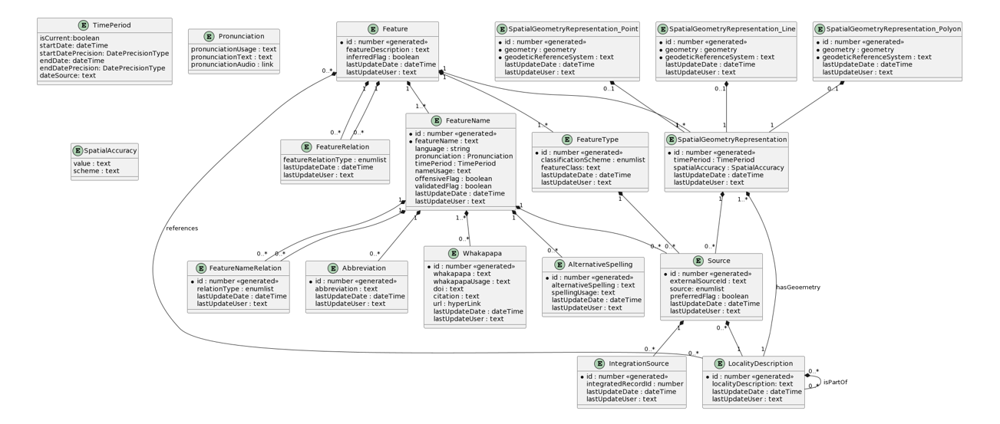

# BioWhere Gazetteer

The **BioWhere Gazetteer** is an advanced geospatial platform that unites multiple data sources into a single, enriched reference for New Zealand’s place names. It integrates information from:
New Zealand Geographic Board (NZGB) Gazetteer, GeoNames Gazetteer and OpenStreetMap primarily along with Māori place name data gathered through case studies.

More than just a list of locations, the BioWhere Gazetteer preserves the **whakapapa** (genealogy) and **kōrero** (stories) behind place names—connecting geography with history, culture, and identity.

---

## 🌟 What Makes It Unique

- **Culturally Rich** – Incorporates stories, history, and ancestral connections (Tipuna) linked to place names.  
- **Community-Driven** – Enables public contributions of names, origins, and features.  
- **Dynamic & Comparative** – Integrates and cross-checks data from multiple trusted sources.  
- **Living Repository** – Ensures cultural heritage is recorded and accessible for future generations.  

---

## Database Schema

> PostgreSQL + PostGIS schema used by the BioWhere Gazetteer.



---
## 🚀 Features

### 🔍 Search Place Names
- Intuitive search bar with real-time suggestions.
- Clicking a result reveals detailed information in the right-side panel.

### 🗺 Toggle Between Map Views
- LINZ Topo50
- LINZ aerial imagery
- OpenStreetMap  
Enables different perspectives of the same location.

### 📚 Source Comparison
- View and compare data for the same place name from different sources via a dropdown menu.

### 📝 Add Alternative Names
- Contribute alternative names for features.
- Include metadata such as language, pronunciation, and historical usage periods.
- Captures the temporality of places over time.

### 📐 Add Alternative Geometry
- Submit improved or alternative geometries (point, line, or polygon).
- Draw directly within the gazetteer interface.

### 📖 Add Kōrero (Origin)
- Record the origin story of a place name.
- Preserve oral histories and cultural narratives.
- Transforms the gazetteer into a **repository of intangible cultural heritage**.

### 👤 Add Tipuna (Ancestor)
- Document ancestors linked to Māori place names.
- Preserve vital genealogical (**whakapapa**) connections.
- One of the most distinctive and culturally significant features of the gazetteer.

### ➕ Add New Features
- Propose entirely new features by defining their geometry and details.
- Geometry can be specified as a point, line, or polygon.
- Ensures the gazetteer evolves alongside the landscape and its stories.

---

## 📌 How to run

The **BioWhere Gazetteer** consists of two main components:  
1. A **Flask web application** (frontend and API).  
2. A **PostgreSQL database** with **PostGIS** enabled (geospatial backend).  

### 1️⃣ Run the Web Application

Navigate to the `/app` directory and run: 

```bash
python run.py
```

### 2️⃣ Populate the Database

Run the scripts in the /scripts directory to load the required datasets into PostgreSQL/PostGIS.

## 📊 Data Sources & Attribution

The BioWhere Gazetteer integrates multiple authoritative and community-driven datasets. Please cite these sources as follows:

* New Zealand Geographic Board (NZGB) Gazetteer — Data sourced from the New Zealand Geographic Board.
* OpenStreetMap (OSM) — © OpenStreetMap contributors, licensed under the Open Database License (ODbL).
* GeoNames — Data from GeoNames, licensed under the Creative Commons Attribution 4.0 License.


