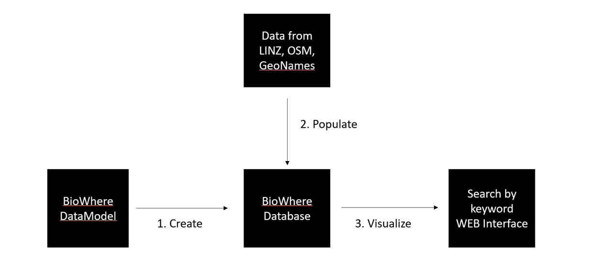
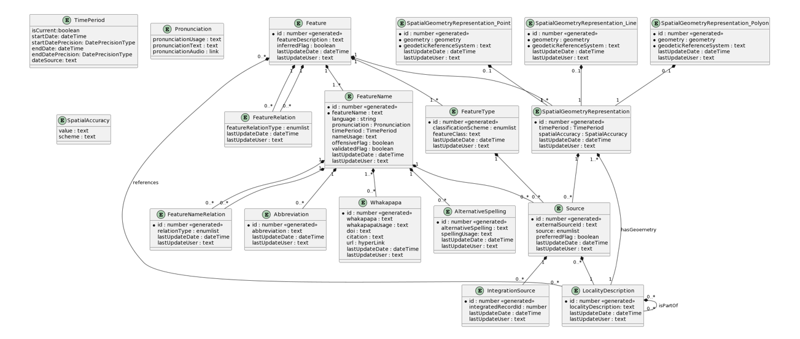
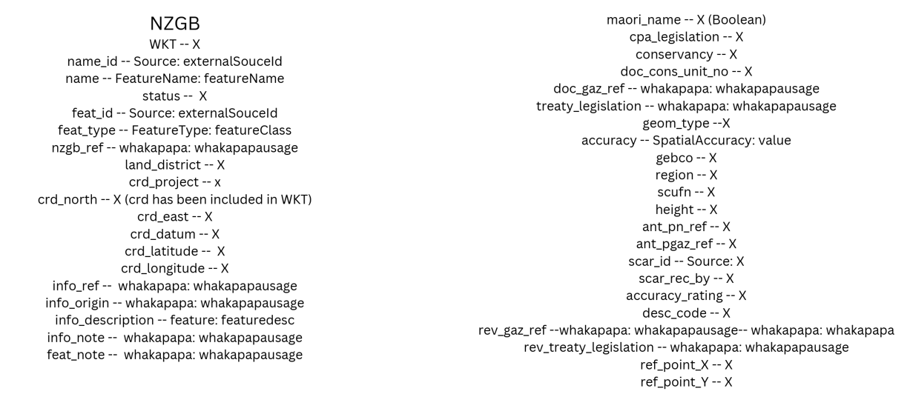
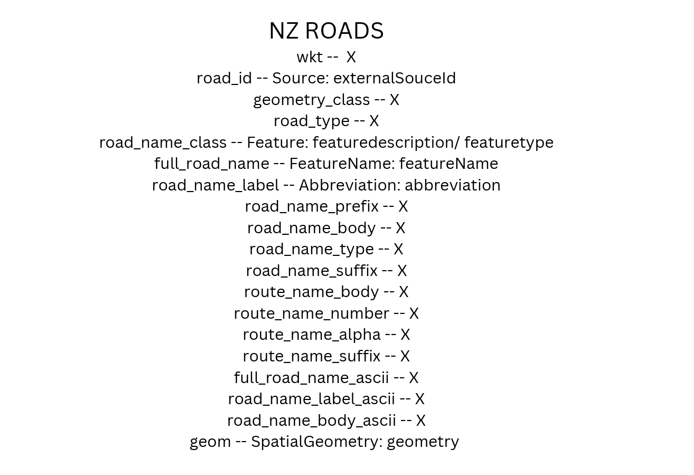
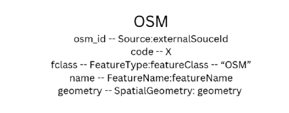
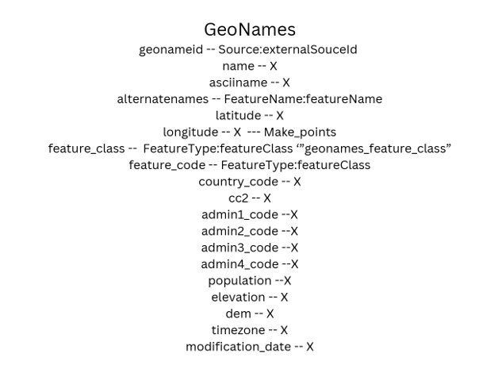
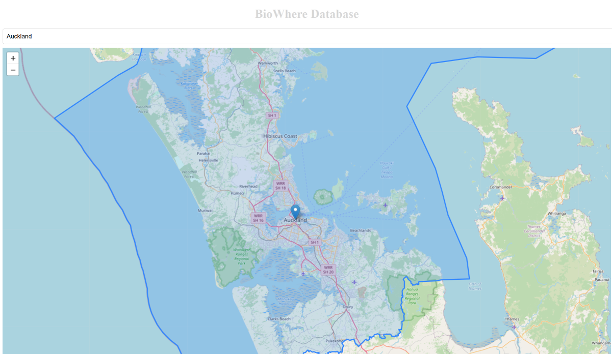

<h1>BioWhere Database</h1>

BioWhere database is the database for BioWhere project which includes data from Land Information New 
    Zealand(LINZ), Open Street Map(OSM) and GeoNames. The structure of database comes from BioWhere 
    Data Model. We also provide BioWhere database web page to visualize the data on the leaflet map. 

<h2>Components</h2>

The relationships and components are shown below:

<h3>BioWhere data Model</h3>

BioWhere data model defines tables, columns, and relationships which are the guidance in creating 
    BioWhere database.

<h3>BioWhere Database</h3>

BioWhere database is based on PostgreSQL with PostGIS extension which will restore the geodata from 
    other databases.

<h3>Mapping</h3>

Rows of geodata from different database contains different columns. Mapping from other database columns 
    to BioWhere database columns according to the data dictionaries is necessary before populating. Here is LINZ NZGB mapping result:  

LINZ Roads mapping result:

OSM mapping result:

GeoNames mapping result:

<h3>Web Interface</h3>

Web interface consists of a search bar, and a leaflet map. When typing more than 4 words into the search 
    bar, it will automatically return feature name in gazetteer contains the typed word. User select certain feature 
    name by clicking, and then the map will jump to area of geometries related to the selected feature name and 
    display as point, line or polygon.

Here is a searched sample: User click item “Auckland” and the database return 2 geometries related to 
    “Auckland”. In the map, the blue point represents point type geometry, and the blue area represents polygon 
    type geometry.

